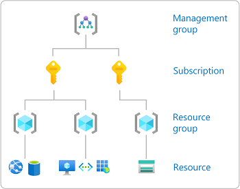

# RBAC(Role-Based Access Control)  
### RBAC(Role-Based Access Control)
- RBAC이란 사용자, 그룹 또는 Azure 리소스 등의 보안주체에게 역할을 할당  
- 할당된 역할에 정의된 권한으로 서비스를 이용  

### ID 및 액세스 관리(IAM, Identity and Access Managmenet)
- Azure 리소스에 대한 액세스 권한을 부여하기 위해 역할을 할당하는 데 일반적으로 사용하는 페이지
- Azure Active Directory : 클라우드 및 하이브리드 환경에 ID 및 액세스 관리 기능 제공  

### [Azure 기본 제공 역활](https://docs.microsoft.com/ko-kr/azure/role-based-access-control/built-in-roles)  
|기본 제공 역활 | 설명 |  
|:---|:---|
| 소유자(Owner) |액세스 권한을 다른 사용자에게 위임할 수 있는 권한을 포함하여 모든 리소스에 대한 전체 액세스 권을 보유 |  
| 기여자(Contributor) | 모든 유형의 Azure 리소스를 만들고 관리할 수 있지만 다른 사용자에게 액세스 권한을 부여할 수 없음 |  
| 읽기 권한자(Reader) | 리소스를 볼 수 있음 |  
| 사용자 액세스 관리자(User Access Administrator) | Azure 리소스에 대한 사용자 액세스를 관리 |  


### RBAC 구현
#### 사용자 역할을 기반으로 권한을 관리하고 적용
**Security Principal - 보안 주체 정의**
- 사용자, 그룹 등

**Role Definition - 역할 정의**
- 예) 네트워크 담당자 - 필요 권한 정의

**Scope - 범위 지정**
- Management Group 적용 / 구독레벨 적용  
  

**보안주체에게 역활과 범위를 할당**
- 예) 네트워크 담당자 - 전체 N/W 에 대한 생성/변경/삭제

### Custom Role
- Built-in Role 은 Management Group 레벨 적용 가능  
  - Built-in Role 매뉴얼 적용  
- Custom Role 은 구독(Subscription) 레벨만 적용 가능  
  - Custom Role 생성 ARM Template 적용   

| Custom Role | 설명 |  
|:---|:---|  
| Serivce Owner Role | 해당 구독의 모든 권한을 가지지만 Network 관련 생성/변경/삭제 권한 제한 |  
| Service Contributor | 리소스의 생성/수정/삭제를 담당하지만 Network 관련 생성/삭제 제한 |  
| Database Admin Role | Azure PaaS DB 제품들의 모든 권한을 가지지만 일부 Network, 보안권한 제한 |  

※ ARM Template 에서 actions 와 notActions 세부항목으로 권한 정의
- **PowerShell**
```
param ($sourceRole, $destinationRole, $subscriptionId)

if ($subscriptionId) {
  Write-Output "az account set --subscription=$subscriptionId"
  az account set --subscription="$subscriptionId"
}
else {
  $subid = (az account show | ConvertFrom-Json).id
  Write-Output "account ID($subid)"
  az account show
}

$users =  az role assignment list --role="$sourceRole" | 
  ConvertFrom-json | 
    Where-Object {($_.principalType -eq 'User') -or ($_.principalType -eq 'Group')} 

foreach($user_pi in $users.principalId) {
  Write-Output "az role assignment create --role '$destinationRole' --assignee $user_pi"
  az role assignment create --role "$destinationRole" --assignee "$user_pi"
}
```

- **ARM Template**
```
{
  "$schema": "https://schema.management.azure.com/schemas/2018-05-01/subscriptionDeploymentTemplate.json#",
  "contentVersion": "1.0.0.0",
  "parameters": {
    "roleDefinitions": {
      "type": "array"
    },
    "assignableScopes": {
      "type": "array"
    }
  },
  "variables": {
    
  },
  "resources": [
    {
      "type": "Microsoft.Authorization/roleDefinitions",
      "apiVersion": "2017-09-01",
      "copy": {
        "name": "definitionCount",
        "count": "[length(parameters('roleDefinitions'))]"
      },
      "name": "[guid(subscription().id, parameters('roleDefinitions')[copyIndex()].roleName)]",
      "properties": {
        "roleName": "[parameters('roleDefinitions')[copyIndex()].roleName]",
        "description": "[parameters('roleDefinitions')[copyIndex()].roleDescription]",
        "type": "customRole",
        "isCustom": true,
        "permissions": [
          {
            "actions": "[parameters('roleDefinitions')[copyIndex()].actions]",
            "notActions": "[parameters('roleDefinitions')[copyIndex()].notActions]"
          }
        ],
        "assignableScopes": "[parameters('assignableScopes')]"
      }
    }    
  ]
}
```
- **parameters**
```
{
  "$schema":"https://schema.management.azure.com/schemas/2015-01-01/deploymentParameters.json#",
  "contentVersion":"1.0.0.0",
  "parameters":{
    "roleDefinitions": {
      "value": [
        {
          "roleName": "SKT Service Owner",
          "roleDescription": "Service owner role",
          "actions": [
            "*"
          ],
          "notActions": [
            "Microsoft.Authorization/elevateAccess/Action",
            "Microsoft.Blueprint/blueprintAssignments/write",
            "Microsoft.Blueprint/blueprintAssignments/delete",
            "Microsoft.Insights/ExtendedDiagnosticSettings/Delete",
            "Microsoft.Insights/DiagnosticSettings/Delete",
            "Microsoft.Authorization/roleDefinitions/write",
            "Microsoft.Authorization/roleDefinitions/delete",
            "Microsoft.Authorization/policyDefinitions/write",
            "Microsoft.Authorization/policyDefinitions/delete",
            "Microsoft.Authorization/policyAssignments/write",
            "Microsoft.Authorization/policyAssignments/delete",
            "Microsoft.PolicyInsights/attestations/write",
            "Microsoft.PolicyInsights/attestations/delete",
            "Microsoft.PolicyInsights/remediations/write",
            "Microsoft.PolicyInsights/remediations/delete",
            "Microsoft.Network/connections/write",
            "Microsoft.Network/connections/delete",
            "Microsoft.Network/connections/sharedKey/write",
            "Microsoft.Network/dscpConfiguration/write",
            "Microsoft.Network/expressRouteCircuits/write",
            "Microsoft.Network/expressRouteCircuits/delete",
            "Microsoft.Network/expressRouteCircuits/authorizations/write",
            "Microsoft.Network/expressRouteCircuits/authorizations/delete",
            "Microsoft.Network/expressRouteCircuits/peerings/write",
            "Microsoft.Network/expressRouteCircuits/peerings/delete",
            "Microsoft.Network/expressRouteCircuits/peerings/connections/write",
            "Microsoft.Network/expressRouteCircuits/peerings/connections/delete",
            "Microsoft.Network/expressRouteCrossConnections/peerings/write",
            "Microsoft.Network/expressRouteCrossConnections/peerings/delete",
            "Microsoft.Network/expressRouteGateways/expressRouteConnections/write",
            "Microsoft.Network/expressRouteGateways/expressRouteConnections/delete",
            "Microsoft.Network/expressRoutePorts/write",
            "Microsoft.Network/expressRoutePorts/delete",
            "Microsoft.Network/localnetworkgateways/write",
            "Microsoft.Network/localnetworkgateways/delete",
            "Microsoft.Network/p2sVpnGateways/write",
            "Microsoft.Network/p2sVpnGateways/delete",
            "Microsoft.Network/routeFilters/delete",
            "Microsoft.Network/routeFilters/write",
            "Microsoft.Network/routeFilters/routeFilterRules/write",
            "Microsoft.Network/routeFilters/routeFilterRules/delete",
            "Microsoft.Network/virtualHubs/delete",
            "Microsoft.Network/virtualHubs/write",
            "Microsoft.Network/virtualHubs/hubRouteTables/write",
            "Microsoft.Network/virtualHubs/hubRouteTables/delete",
            "Microsoft.Network/virtualHubs/hubVirtualNetworkConnections/write",
            "Microsoft.Network/virtualHubs/hubVirtualNetworkConnections/delete",
            "Microsoft.Network/virtualHubs/routeTables/write",
            "Microsoft.Network/virtualHubs/routeTables/delete",
            "Microsoft.Network/virtualNetworkGateways/write",
            "Microsoft.Network/virtualNetworkGateways/delete",
            "Microsoft.Network/virtualNetworks/write",
            "Microsoft.Network/virtualNetworks/delete",
            "Microsoft.Network/virtualNetworks/virtualNetworkPeerings/write",
            "Microsoft.Network/virtualNetworks/virtualNetworkPeerings/delete",
            "Microsoft.Network/virtualRouters/write",
            "Microsoft.Network/virtualRouters/delete",
            "Microsoft.Network/virtualRouters/peerings/write",
            "Microsoft.Network/virtualRouters/peerings/delete",
            "Microsoft.Network/virtualWans/delete",
            "Microsoft.Network/virtualWans/write",
            "Microsoft.network/virtualWans/p2sVpnServerConfigurations/write",
            "Microsoft.network/virtualWans/p2sVpnServerConfigurations/delete",
            "Microsoft.Network/vpnGateways/write",
            "Microsoft.Network/vpnGateways/delete",
            "microsoft.network/vpnGateways/vpnConnections/write",
            "microsoft.network/vpnGateways/vpnConnections/delete",
            "Microsoft.Network/vpnServerConfigurations/write",
            "Microsoft.Network/vpnServerConfigurations/delete",
            "Microsoft.Network/vpnsites/write",
            "Microsoft.Network/vpnsites/delete",
            "Microsoft.Network/natGateways/write",
            "Microsoft.Network/natGateways/delete",
            "Microsoft.Network/networkInterfaces/tapConfigurations/write",
            "Microsoft.Network/networkInterfaces/tapConfigurations/delete",
            "Microsoft.Network/networkWatchers/delete",
            "Microsoft.Network/networkWatchers/flowLogs/delete",
            "Microsoft.Network/networkWatchers/flowLogs/write",
            "Microsoft.Network/networkWatchers/write",
            "Microsoft.Network/routeTables/write",
            "Microsoft.Network/routeTables/delete"
          ]
        },
        {
          "roleName": "SKT Service Contributor",
          "roleDescription": "Service contributor role",
          "actions": [
            "*"
          ],
          "notActions": [
            "Microsoft.Authorization/*/Write",
            "Microsoft.Authorization/*/Delete",
            "Microsoft.Authorization/elevateAccess/Action",
            "Microsoft.Blueprint/blueprintAssignments/write",
            "Microsoft.Blueprint/blueprintAssignments/delete",
            "Microsoft.Insights/ExtendedDiagnosticSettings/Delete",
            "Microsoft.Insights/DiagnosticSettings/Delete",
            "Microsoft.Authorization/roleDefinitions/write",
            "Microsoft.Authorization/roleDefinitions/delete",
            "Microsoft.Authorization/policyDefinitions/write",
            "Microsoft.Authorization/policyDefinitions/delete",
            "Microsoft.Authorization/policyAssignments/write",
            "Microsoft.Authorization/policyAssignments/delete",
            "Microsoft.PolicyInsights/attestations/write",
            "Microsoft.PolicyInsights/attestations/delete",
            "Microsoft.PolicyInsights/remediations/write",
            "Microsoft.PolicyInsights/remediations/delete",
            "Microsoft.Network/connections/write",
            "Microsoft.Network/connections/delete",
            "Microsoft.Network/connections/sharedKey/write",
            "Microsoft.Network/dscpConfiguration/write",
            "Microsoft.Network/expressRouteCircuits/write",
            "Microsoft.Network/expressRouteCircuits/delete",
            "Microsoft.Network/expressRouteCircuits/authorizations/write",
            "Microsoft.Network/expressRouteCircuits/authorizations/delete",
            "Microsoft.Network/expressRouteCircuits/peerings/write",
            "Microsoft.Network/expressRouteCircuits/peerings/delete",
            "Microsoft.Network/expressRouteCircuits/peerings/connections/write",
            "Microsoft.Network/expressRouteCircuits/peerings/connections/delete",
            "Microsoft.Network/expressRouteCrossConnections/peerings/write",
            "Microsoft.Network/expressRouteCrossConnections/peerings/delete",
            "Microsoft.Network/expressRouteGateways/expressRouteConnections/write",
            "Microsoft.Network/expressRouteGateways/expressRouteConnections/delete",
            "Microsoft.Network/expressRoutePorts/write",
            "Microsoft.Network/expressRoutePorts/delete",
            "Microsoft.Network/localnetworkgateways/write",
            "Microsoft.Network/localnetworkgateways/delete",
            "Microsoft.Network/p2sVpnGateways/write",
            "Microsoft.Network/p2sVpnGateways/delete",
            "Microsoft.Network/routeFilters/delete",
            "Microsoft.Network/routeFilters/write",
            "Microsoft.Network/routeFilters/routeFilterRules/write",
            "Microsoft.Network/routeFilters/routeFilterRules/delete",
            "Microsoft.Network/virtualHubs/delete",
            "Microsoft.Network/virtualHubs/write",
            "Microsoft.Network/virtualHubs/hubRouteTables/write",
            "Microsoft.Network/virtualHubs/hubRouteTables/delete",
            "Microsoft.Network/virtualHubs/hubVirtualNetworkConnections/write",
            "Microsoft.Network/virtualHubs/hubVirtualNetworkConnections/delete",
            "Microsoft.Network/virtualHubs/routeTables/write",
            "Microsoft.Network/virtualHubs/routeTables/delete",
            "Microsoft.Network/virtualNetworkGateways/write",
            "Microsoft.Network/virtualNetworkGateways/delete",
            "Microsoft.Network/virtualNetworks/write",
            "Microsoft.Network/virtualNetworks/delete",
            "Microsoft.Network/virtualNetworks/virtualNetworkPeerings/write",
            "Microsoft.Network/virtualNetworks/virtualNetworkPeerings/delete",
            "Microsoft.Network/virtualRouters/write",
            "Microsoft.Network/virtualRouters/delete",
            "Microsoft.Network/virtualRouters/peerings/write",
            "Microsoft.Network/virtualRouters/peerings/delete",
            "Microsoft.Network/virtualWans/delete",
            "Microsoft.Network/virtualWans/write",
            "Microsoft.network/virtualWans/p2sVpnServerConfigurations/write",
            "Microsoft.network/virtualWans/p2sVpnServerConfigurations/delete",
            "Microsoft.Network/vpnGateways/write",
            "Microsoft.Network/vpnGateways/delete",
            "microsoft.network/vpnGateways/vpnConnections/write",
            "microsoft.network/vpnGateways/vpnConnections/delete",
            "Microsoft.Network/vpnServerConfigurations/write",
            "Microsoft.Network/vpnServerConfigurations/delete",
            "Microsoft.Network/vpnsites/write",
            "Microsoft.Network/vpnsites/delete",
            "Microsoft.Network/natGateways/write",
            "Microsoft.Network/natGateways/delete",
            "Microsoft.Network/networkInterfaces/tapConfigurations/write",
            "Microsoft.Network/networkInterfaces/tapConfigurations/delete",
            "Microsoft.Network/networkWatchers/delete",
            "Microsoft.Network/networkWatchers/flowLogs/delete",
            "Microsoft.Network/networkWatchers/flowLogs/write",
            "Microsoft.Network/networkWatchers/write",
            "Microsoft.Network/routeTables/write",
            "Microsoft.Network/routeTables/delete"
          ]
        },
        {
          "roleName": "SKT Database Admin",
          "roleDescription": "Service database admin role",
          "actions": [
            "Microsoft.Authorization/*/read",
            "Microsoft.Insights/alertRules/*",
            "Microsoft.ResourceHealth/availabilityStatuses/read",
            "Microsoft.Resources/deployments/*",
            "Microsoft.Resources/subscriptions/resourceGroups/read",
            "Microsoft.Sql/*",
            "Microsoft.DBforMariaDB/*",
            "Microsoft.DBforMySQL/*",
            "Microsoft.DBforPostgreSQL/*",
            "Microsoft.DocumentDB/*",
            "Microsoft.Cache/*",
            "microsoft.web/sites/slots/functions/*",
            "Microsoft.Support/*",
            "Microsoft.Insights/metrics/read",
            "Microsoft.Insights/metricDefinitions/read"
          ],
          "notActions": [
            
          ]
        }
      ]
    }
  }
}
```


